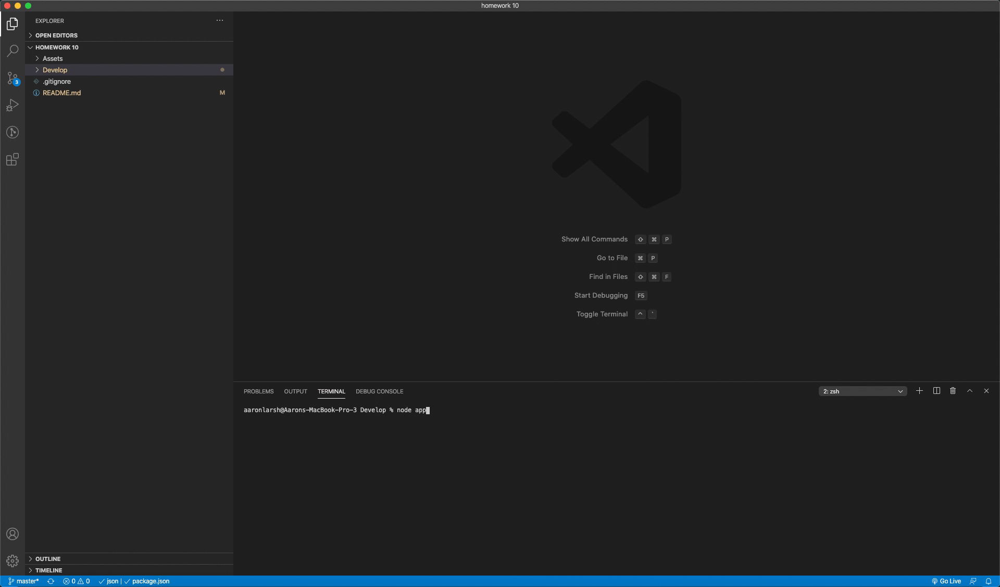

# Template Engine - Employee Summary

This CLI will allow users to quickly generate teams list. T 

## Instructions

1. Run node app.js
1. User is asked how many people are on their team
1. User is asked to enter in the first employee's name 
1. User is asked to enter in the first employee's ID number
1. User is asked to enter in the first employee's email address
1. User is asked to choose the first employee's role: Manager, Engineer, or Intern.
1. Depending on users choice they will be ask more questions that pertain to the role chosen for then employee
1. Steps 3-7 are looped based on the number of team members
1. An html file, team.html, is created inside the folder output

### directory structure looks like this:

```
lib/           // classes and helper code
output/        // rendered output
templates/     // HTML template(s)
test/          // jest tests
  Employee.test.js
  Engineer.test.js
  Intern.test.js
  Manager.test.js
app.js         // Runs the application
```

### Demo

